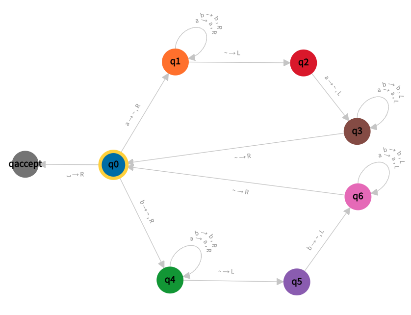

# Práctica de Máquinas de Turing

En este repo vamos a ver un ejemplo de una máquina de turing utilizando la librería autómata.

La máquina que vamos a implementar decide el lenguaje palindromos que se define el lenguaje de las palabras de longitud par sobre el alfabeto { a, b } donde el primer caracter es igual al último, el segundo al ante-último y así.

Son palabras de este lenguaje aabbaa, pero no aabaa porque no es par.

Este lenguaje es reconocible por una autómata de pila, pero no de forma determinística. La implementación usando Máquinas de Turing es deterministica.

## La máquina

Vamos a definir una MT de 8 estados con el siguiente diagrama de transiciones:



La estrategia de esta máquina es:
 
 1. Lee un carácter al pcpio de la cinta,
 2. lo reemplaza por ~ al principio y se mueve a derecha
 3. mientras lee a y b sigue moviendose a derecha
 3. encuentra el primer ~ (final) y vuelve a izquierda
 4. verifica que coincida con el primer caracter encontrado
 5, vuelve al principio y sigue desde 1
 6. acepta cuando solo hay ~

En el diagrama de transiciones vemos dos ramas bien definidas. Una por 'a' y otra por 'b'.

Si todo fue bien, vuelve al principio y a buscar. 

Cuando aparece un caracter que no tiene definida transición por defecto la MT rechaza. Por ejemplo si aparece una 'b' en q2 o una 'a' en q5,

¿qué pasa si la cinta está vacía?

## Correr las pruebas

Debemos tener python 3.9 o superior y la herramienta llamada pip. Se recomienda usar un IDE para analizar pero correr las herramientas por la terminal.

La primera vez creamos un entorno virtual, lo activamos e instalamos las librerías. La primera vez corremos:

```
python -m venv venv
. venv/bin/activate    # en windows venv\Scripts\activate
pip install -r requirements.txt
```

Luego cuando queramos correr solo se activa el entorno virtual:

```
. venv/bin/activate    # en windows venv\Scripts\activate
```


### Correr las pruebas

```
pytest
```

### Analizar

Con el entorno activado:

```
python analizar.py
```

Este programa espera que uno ingrese palabras. Al apretar enter verifica si ACEPTA o RECHAZA la palabra.

Con el parametro --debug podremos ver paso a paso el estado,

### Descripción

El archivo palindromos.py tiene la máquina propiamente dicha. Ahí podemos ver la definición de la máquina como un objeto de la clase DTM de la librería autómata:

```python
palindromos = DTM(
    states={'q0', 'q1', 'q2', 'q3', 'q4', 'q5', 'q6', 'qacc'},
    input_symbols={'a', 'b'},
    tape_symbols={'a', 'b', '~'},
    transitions=las_transiciones,
    initial_state='q0',
    blank_symbol='~',
    final_states={'qacc'}
)
```

Si recordamos la teórica las máquinas de Turing determinísticas se definían como una t-upla.

El parámetro transitions es la definición de la función de transición. Recordemos que esta recibía el estado actual y el caracter leído de la cinta y devolvía el caracter a estado destino, el acarácter a escribir y la dirección en que se mueve el cabezal.

La librería autómata nos pide que lo declaremos como un diccionario python:

```python
las_transiciones={
    'q0': {
        'a': ('q1', '~', 'R'),       # (q0,a) -> (q1, ~, R)  asi sería la transición como vimos en la teórica.
        'b': ('q4', '~', 'R'),
        '~': ('qacc', '~', 'R')
    },
#    ... faltan un más de estados! ...
```

En este caso vemos que las transiciones que acepta el estado q0 son a, b y ~ (la vírgula o caracter vacío) y con esta acepta la palraba. El caracter 'a' va al estado q1 y empieza a correrse a derecha para buscar el final de la cadena y verificar que termine en 'a'. Análogamente 'b' hace lo mismo desde el estado q4.

En el archivo test_maquina tenemos dos funciones que usan la máquina y la prueban. En la primera función le pasamos los casos que debe aceptar y en la segunda los que debe rechazar.

## Preguntas

- agregar nuevos casos de prueba
- ¿es posible extender la mt para el alfabeto { a, b, c }? ¿cómo?
- ¿cómo sería la MT para palíndromos de 0 y 1s?
- ¿con el códido en este repo podemos evaluar paso a paso una máquia y escribir el historial de cómputos?
- buscar otra máquina de Turing de alguna materia que hayamos hecho e implementarla con la librería y escribir las pruebas.
- ¿qué diferencia hay entre cadena y palabra?
- ¿podemos armar un programita que decida un lenguaje para el cuál conocemos una MT que lo decide?
